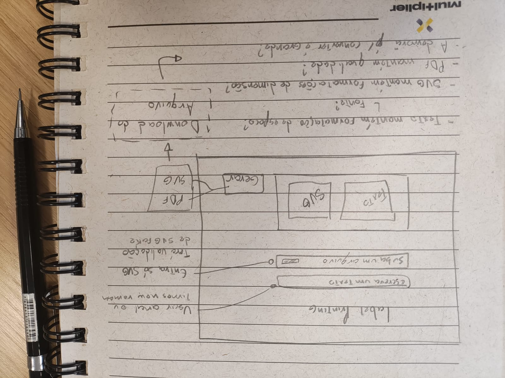

# poc-label-web-printing

# Objetivo

Analisar a viabilidade de gerar etiquetas para impressão sem perda de qualidade da imagem.

# Justificativa

O cliente possui hoje um sistema web que quando gera arquivos para impressão nos  seguintes formatos:

- Arquivo de Imagem
    - Tipos
        - JPG
        - PNG
        - BMP
    - Qualidades
        - 300 dpi
        - 150 dpi
        - 96 dpi
        - 72 dpi
- Arquivos PCX (Picture Exchange)
- Arquivos BMP
- Arquivos PDF
- Arquivos SVG

Porém os arquivos gerados tem perdido qualidade, formatação no momento da conversão de arquivos inputados para a saída desejada. Para isso a POC deve verificar a viabilidade de manter a qualidade e formatação com novos parâmetros.

# Premissas

1. O sistema deve ter um input de texto
2. O sistema deve ter um input de imagem
    1. Esse input deve aceitar somente .svg
    2. Esse input deve validar se o svg inserido é um vetor ou uma imagem convertida em svg (Imagens quando convertidas para SVG são abraçadas pela tag ````<svg>````)
3. O sistema deve ter uma div que servirá de preview para o texto e o svg inseridos
4. O sistema deve permitir o download do conteúdo em PDF
5. O sistema deve permitir o download do conteúdo em SVG





# Propostas Avaliadas

1. É possivel converter Imagem para SVG?
    1. Sim, injetando a img na tag svg. Isso não a transforma em um vetor mas muda seu tipo de arquivo, portanto, redimensionar o arquivo não preserva sua qualidade. 
2. É possível gerar um PDF (````PDF/X-1A````)
    1. As formatações de (espaçamento ou expessura) se mantém não afetadas?
    2. As fontes se mantém não afetadas?
3. É possível gerar um SVG
    1. É possivel detectar quais svgs que são conversões de imagens? (Imagens quando convertidas para SVG são abraçadas pela tag ````<svg>````)

# Avaliação das Propostas

*Escrever aqui..*

# Resultados Obtidos

*Escrever aqui..*

# Envolvidos

- Gabriel Rodrigues

---

<p style="text-align: center"> Feito com 💙 </p>
