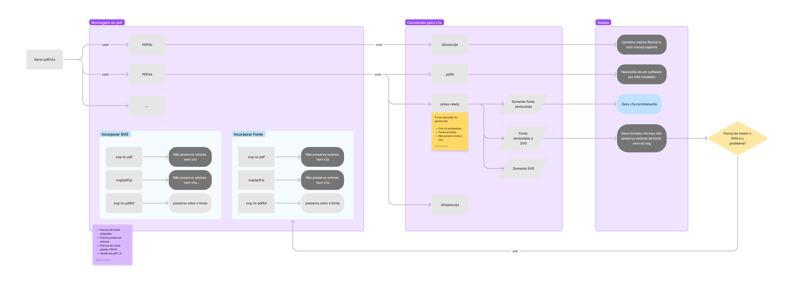

# poc-label-web-printing

# Objetivo

Analisar a viabilidade de gerar etiquetas para impressão sem perda de qualidade da imagem.

# Justificativa

O cliente possui hoje um sistema web que quando gera arquivos para impressão nos seguintes formatos

- Arquivo de Imagem
    - Tipos
        - JPG
        - PNG
        - BMP
    - Qualidades
        - 300 dpi
        - 150 dpi
        - 96 dpi
        - 72 dpi
- Arquivos PCX (Picture Exchange)
- Arquivos BMP
- Arquivos PDF
- Arquivos SVG

Porém os arquivos gerados tem perdido qualidade, formatação no momento da conversão de arquivos inputados para a saída desejada. Para isso a POC deve verificar a viabilidade de manter a qualidade e formatação com novos parâmetros.

# Premissas

**Server-side com NodeJs**

- [x]  Gerar PDF
    - [x]  Preservar fontes / preservar vetores
- [x]  Converter para``` X1a```
    - [ ]  ~~PDFKit + pdftk~~
    - [ ]  ~~PDFKit + Ghostscript~~
    - [ ]  ~~pdf-lib + Ghostscript~~
    - [x]  PDFKit + press-ready
        - [ ]  ~~Preservar fontes e preservar vetores~~



**Client-side com ReactJs**

- [x]  O sistema deve ter um input de texto
- [x]  O sistema deve ter um campo de upload
    - [x]  Esse input deve aceitar somente ```.svg```
    - [ ]  Esse input deve validar se o svg inserido é um vetor ou uma imagem convertida em svg (Imagens quando convertidas para SVG são abraçadas pela tag ```<svg>```)
- [x]  O sistema deve ter uma div que servirá de preview para o texto e o svg inseridos
- [ ]  O sistema deve permitir o download do conteúdo em PDF
- [ ]  O sistema deve permitir o download do conteúdo em SVG


# Propostas Avaliadas

1. Libs de renderização de pdfs
    1. A partir do html
    2. Montagem do zero com js
2. Libs de conversão de pdf para subtipo x1-a
3. Preservação da qualidade de imagem e vetores 

**Detalhamento**

- Geração de imagem para SVG
    1. Injetando a img na tag svg. Isso não a transforma em um vetor mas muda seu tipo de arquivo, portanto, redimensionar o arquivo não preserva sua qualidade. 
    2. É possivel detectar quais svgs que são conversões de imagens? (Imagens quando convertidas para SVG são abraçadas pela tag ````<svg>````)
- Conferir tamanho do arquivo e tempo de geração

# Avaliação das Propostas

[Como as libs renderizam pdfs? (PDF/X-1A) | [pesquisa]](./server-examples-with-nodejs/RENDERING_X1A.md)

[Como incorporar meu arquivo de fonte ao meu pdf | [pesquisa]](./server-examples-with-nodejs/EMBED_FONTS.md)

# Resultados Obtidos

As libs de renderização de pdf com javascript pelo lado do client ainda são bastante limitadas, não existem muitas alternativas, possibilidades aprofundadas para lidar com esse cenário e as documentações também não são ricas.


# Referências
    
[https://medium.com/coderbyte/generate-a-pdf-with-javascript-3e53ca7b47e](https://medium.com/coderbyte/generate-a-pdf-with-javascript-3e53ca7b47e)
    
[https://dev.to/handdot/generate-a-pdf-in-js-summary-and-comparison-of-libraries-3k0p](https://dev.to/handdot/generate-a-pdf-in-js-summary-and-comparison-of-libraries-3k0p)
    
[https://stackoverflow.com/questions/312230/proper-mime-media-type-for-pdf-files](https://stackoverflow.com/questions/312230/proper-mime-media-type-for-pdf-files)
    
[https://www.devmedia.com.br/manipulando-pdf-com-ghostscript/34424](https://www.devmedia.com.br/manipulando-pdf-com-ghostscript/34424)
    
[https://portswigger.net/research/portable-data-exfiltration](https://portswigger.net/research/portable-data-exfiltration)

---

<p style="text-align: center"> Feito com 💙 </p>
